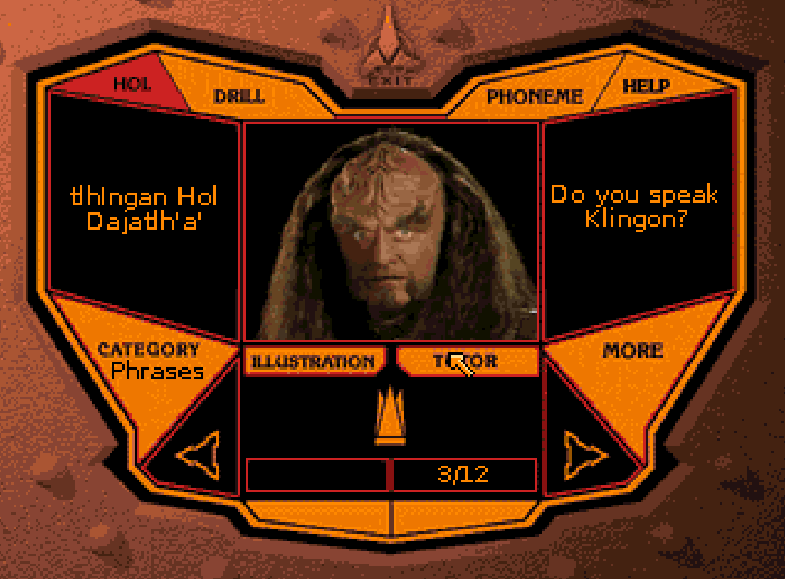

# Klingon Language Lab for the Commodore CDTV

A conversion for the CDTV (Amiga OCS, Kickstart 1.3, 1 MB of chip RAM) of the
[Klingon Language Lab](https://github.com/na103/KLL), built from the content of
the original 1996 CD-ROM. A personal project.

## Licence and content

The code in this repository (C and assembler sources, conversion tools) is
mine and is under the MIT licence, see `LICENSE`.

**The content of the CD-ROM is not included and may not be redistributed.**
The video, audio and artwork of the *Klingon Language Lab* belong to their
respective owners: the tools here read them from your own copy of the original
CD and produce a CDTV version of them, on your own machine. For the same
reason the `CDTV.TM` trademark file and the `RMTM` utility are not included
either, as they belong to Commodore: get them separately (see below). The ISO
image `make` produces contains copyrighted material, so keep it to yourself.

A hobby project, with no connection to the owners of the works and trademarks
named here, which are used only to say which product this is about.



## What it does

The program starts at the title screen, opens the main menu and lets you
browse the **HOL** section (the eight categories of words and phrases): for
every entry it shows the Klingon and English text and the picture, plays the
audio and, on request, the "more" commentary or the tutor clip. From the bar
at the top you reach **PHONEME**, the pronunciation section: the 34 sounds of
Klingon, each with its sound, an example word and the clip of a Klingon saying
it; and **DRILL**, the exercises on the open category: eleven questions of
three kinds (read the Klingon and pick the translation, listen to four entries
and confirm with CHOOSE, listen to one entry and pick the translation), then
the score screen with the commander's filmed verdict. **HELP**, present on all
three screens, turns on help mode: the command you touch is described instead
of being run, using the texts of the original CD.

Controls (button A on the CDTV remote is the left mouse button, button B the
right one):

| Where | Command |
|---|---|
| title | a click goes straight to the menu |
| menu | any of the eight entries opens the HOL section |
| menu | CREDITS shows the closing titles, EXIT quits and reboots the CDTV |
| menu | EXIT only works here: the closing animation takes this screen apart |
| HOL | the arrows at the bottom move to the previous or next entry |
| HOL | ILLUSTRATION brings the picture back, TUTOR plays the clip |
| HOL | MORE plays the second commentary, when the entry has one |
| HOL | CATEGORY returns to the menu, PHONEME opens the pronunciation |
| PHONEME | any of the 34 buttons plays the sound, the example word and the clip |
| PHONEME | PHONEME repeats the sound, MORE the explanation, EXAMPLE the clip |
| PHONEME | HOL returns to the words, DRILL opens the exercises |
| DRILL | every question opens with the hint about what to do |
| DRILL | you answer by touching one of the four boxes |
| DRILL | in the four-entry kind you listen to a box and confirm with CHOOSE |
| DRILL | REPEAT plays the question again; after eleven answers comes the score |
| DRILL | on a wrong answer the commander comments on the entry you picked |
| anywhere | HELP turns on help mode: the command you touch is described instead of run; touch HELP again to leave |
| anywhere | button B (or ESC) goes back one level |
| HOL | key 0 shows the diagnostics of the last clip |

The diagnostics appear in the English panel: frames shown (`vis`), dropped
because they were late (`salt`), times the audio ran dry (`buchi`), slowest
read from the CD in fiftieths of a second (`lett`), raster lines used by the
longest copy (`cop`) and stripes copied late (`tardi`).

## Requirements

- the `m68k-amigaos-gcc` toolchain (bebbo) and `vasmm68k_mot` in `PATH`
- Python 3 with `numpy`, `Pillow`, `pycdlib`
- `ffmpeg`
- `mkisofs` (the `genisoimage` package)
- your own image of the original CD
- the `CDTV.TM` trademark file and the `RMTM` utility (see below)

`make check` verifies all of this in one go and names whatever is missing.

## Building the CD

```sh
make ISO=path/to/klingon.iso
```

That unpacks the original image, converts pictures, audio and clips, builds
the Amiga executable and writes a bootable `build/KLL_CDTV.iso`. The two
Commodore files are expected in `cdtv/CDTV.TM` and `cdtv/RMTM`; pass `TM=` and
`RMTM=` to take them from somewhere else, and `ISO` defaults to
`iso/klingon.ISO`, so a copy there needs no arguments at all.

```sh
make check      # only check the tools and the input files
make extract    # only unpack the original ISO into build/src
make exe        # only the build/cd/KLL executable
make media      # only the entry content (pictures, audio, clips)
make test       # check the C decoder against the Python one
```

Converting the 98 clips is the slow part and can be cut down while working on
the program:

```sh
make MEDIA_FLAGS=--no-video     # no clips
make MEDIA_FLAGS="--only 2"     # only the first two entries of each category
```

Files that are already up to date are skipped, so the conversion can be
interrupted and resumed. The complete ISO is about 50 MB.

Burning it: write the image as-is ("burn image"). If the burning program
builds a new data disc out of the files it will rebuild the filesystem and
lose the `CDTV.TM` in the System Area, and the CDTV will not boot.

## CDTV.TM

The CDTV only boots CDs that carry the Commodore trademark file in the System
Area. In an ISO image (2048-byte sectors) of an original CDTV title it starts
at sector 2:

```sh
dd if=some_cdtv_title.iso of=cdtv/CDTV.TM bs=2048 skip=2 count=11
```

Alternatively use the one fetched by
[cdtv-qdtitle](https://github.com/C4ptFuture/cdtv-qdtitle), which saves it to
`~/.cache_cdtv.tm`. The ISO creation procedure (`tools/mkcdtv.py`) follows the
one in cdtv-qdtitle.

## RMTM

The CDTV trademark screen stays on top of the program until the `RMTM` utility
of the CDTV developer kit is run. Put it in `cdtv/RMTM` (not included): it is
copied to `C/RMTM` and launched by the Startup-Sequence after `KLL`, as a
safety net — the program itself normally removes the logo (see below).

## Testing in WinUAE

1. Quickstart → **CDTV** model, with Kickstart 1.3 and the CDTV 1.0 extended ROM.
2. CD & Hard drives → CD image `build/KLL_CDTV.iso`.
3. Boot: the CDTV runs `S/Startup-Sequence`, which launches `KLL`.

Build with `make KLL_NO_REBOOT=1` while developing, so EXIT returns to the CLI
instead of starting the CD all over again under the emulator.

## Layout of the repository

| Path | Contents |
|---|---|
| `src/` | the Amiga program (C and assembler) |
| `tools/` | content conversion and ISO creation |
| `cdroot/` | files copied to the CD as they are |
| `build/src/` | files unpacked from the original ISO |
| `build/gen/` | C headers generated by the tools |
| `build/cd/` | the content of the CDTV CD |

On the CD: `DATA` holds the screens, the command atlases and the database,
`IMG` the entry pictures, `SND` the entry audio, `SFX` the interface sound
effects, `VIDEO` the clips and `DRILL` the drill screens.

## The program

| File | Contents |
|---|---|
| `src/main.c` | screen, vertical blank, audio.device, reboot on exit |
| `src/app.c` | the screens and the moves between them |
| `src/ui.c` | font, word-wrapped text, pointer |
| `src/pic.c` | KPIC images, whole or cut out of an atlas |
| `src/db.c` | database of entries and phonemes |
| `src/snd.c` | whole samples (effects and speech) |
| `src/video.c` | playback of the KXL clips |
| `src/delta.c` | frame decoding |
| `src/audio.c` | audio.device queues |
| `tools/layout.py` | interface geometry, and the C header generated from it |
| `tools/mkfont.py` | proportional `TextFont` built from a TrueType font |

`tools/layout.py` holds the geometry of the interface (rectangles, hot spots,
cutouts of the lit commands) measured on the original screens and generates
`build/gen/layout.h` from it, so the C code and the converters use the same
numbers.

The 34 lit phoneme buttons live in the `PRONUNH.BMP` sheet in two columns that
do not follow the order of the buttons on screen: they were matched by
comparing the shape of the lettering on each button with the one on the
background screen (minimum similarity 0.98).

Deliberate differences from the Mac port:

- the hot spots of the menu follow the eight slanted rows of the two columns
  (in the Mac port they were eight small rectangles, nearly all on the first
  row);
- the text does not use the ROM topaz 8 (eight pixels per character, nine
  characters across a panel) but a proportional font of the same height built
  in RAM by `tools/mkfont.py`: nearly twice as much text fits in a panel.
  Change it with `make FONT_TTF=... FONT_SIZE=...`;
- the CDTV trademark is removed by the program itself (`trademark_off`) once
  the title screen is ready, rather than by the `Startup-Sequence`: that way
  the logo covers the loading and the boot CLI is never seen. It does what the
  `RMTM` utility does, calling the function at -144 of `playerprefs.library`;
- the opening skips the production credits and the Simon & Schuster logo
  (screens `SPLASH01`-`SPLASH05` and the music that went with them) and starts
  at the title screen: at 320x256 that text cannot be read;
- the pointer disappears during animations, sounds and clips, and comes back
  when the program waits for a command;
- the cutouts of the lit commands are halved together with the screen they
  land on (`convimg.crop_tile`): halving the cutout alone shifted it by half a
  pixel and dragged in the white that separates the cells of the sheet;
- screens are copied in stripes, each as soon as the raster beam has passed
  it: the blitter and RectFill work one bitplane at a time, and an area the
  beam crossed showed for one frame with its planes mixed (the pale streak in
  the transitions and the stray pixels left in the rectangle at the end of a
  clip);
- the position in the list (`3/12`) is shown in one of the two black boxes at
  the bottom, which the original CD leaves empty: with a remote control it is
  not otherwise obvious where you are.

The clips carry the interface colours in their palette too, so they depend on
`build/gui_palette.json`: if it changes they all have to be converted again,
otherwise they keep the old colours and fill up with wrong ones.
`tools/mkmedia.py` takes care of that by watching the date of the palette.

Known limits of this version:

- the font is generated from a system TrueType (`DejaVuSans` at 10 pixels by
  default), so the result depends on the fonts installed on the machine that
  builds it; words longer than a line are broken with a hyphen;
- the longer "more" commentaries (up to 25 seconds, 270 KB) are read into
  memory before they start, so on a 1x drive they follow a few seconds of
  waiting; they should be read in blocks like the clip audio;
- the category name under CATEGORY uses the same font as everything else,
  wider than the one on the CD: "Commands" is shortened to "Comm" to fit the
  panel.

## Leaving the program

There is no CLI to return to on a CDTV, so EXIT reboots the machine, the way
the CD titles do. `ColdReboot()` arrived with 2.0, so `src/main.c` does what
the ROM does: in supervisor mode, with interrupts off, it takes the boot
vector from the ROM (whose length lives at `$00FFFFEC`), pulls the RESET line
and jumps in; the jump follows `RESET` immediately and is already in the
prefetch queue, so it gets there even while the machine is resetting.

## Formats

**Images (KPIC)**: `'KPIC'`, width, height, bitplanes, number of colours,
first colour (big-endian UWORDs), the colours as 0x0RGB, then bitplanes with
rows aligned to 16 bits. Screens and command cutouts use colours 0-15 from a
shared palette, without dithering; the entry pictures use colours 16-31 like
the clips, skipping 17-19, which belong to the pointer.

The commands of a screen, lit and unlit, all live in one image
(`DATA/HOLBTN.PIC`, 320x183) that stays in memory while the section is open:
lighting or clearing a command is one copy from the atlas, and the "unlit"
cutout is the same rectangle taken from the background screen. The lit cutouts
come from the `HOLH.BMP`, `PRONUNH.BMP` and `MAINH.BMP` sheets of the original
CD, which collect the highlighted versions of the commands.

**Entries (KDB1)**: one record per entry with the Klingon and English text and
the file names (audio, second commentary, clip, picture, and the two comments
on a wrong drill answer), grouped by category; the whole file sits in memory,
under 16 KB. The format is described in `tools/mkdb.py`.

**Audio (RAW)**: signed 8-bit PCM at 11025 Hz mono, the format the program
hands to audio.device without any conversion. A single write to audio.device
cannot exceed 65535 words: the channel length counter is 16-bit, and past that
the count wraps around, so longer samples are queued in 64 KB chunks that the
device plays back to back.

**Video (KXL3)**: the format is described in `tools/kxl.py`, with a checksum
per block (only verified with the `VIDEO_VERIFY` flag: summing 32 KB costs a
few milliseconds and would make the waiting stripes miss their window) and the
expected frame buffer sum after every frame. 118×88, 5 bitplanes, 15 fps, mono
8-bit audio at 11040 Hz (736 samples per frame). The video is coded as the
difference from the previous frame, with pairs of bytes (skip, copy) per
bitplane: about 50 KB/s instead of the 115 of an uncompressed CDXL, which the
CDTV cannot read fast enough. After a 2048-byte header the file is split into
32 KB blocks, read with asynchronous DOS packets while the player keeps
showing frames; every block holds the audio of its own frames, contiguous,
played with a single write.

Two read requests are kept in flight (out of five blocks in memory), so the
file system always has one queued and the drive never stops while the CPU
verifies a block and decodes frames: packets to one handler are served in
order, so the blocks arrive in file order.

After every copy the blitter is waited for with two `WaitBlit()` calls: on a
68000 the blitter-busy bit of `DMACONR` can still read as clear in the first
cycles after the start, so a single check may return at once and decoding the
next frame would overwrite the frame buffer while the blitter is reading it.

Copying the frame buffer to the screen is synchronised with the raster:
`BltBitMap` copies one bitplane at a time, and if the beam crosses the
rectangle during the copy the lines it has passed show some bitplanes of the
new frame and some of the old one, that is, pixels in colours that do not
exist, scattered as pale dots. One whole copy of 118×88 over five bitplanes
takes more than two hundred raster lines out of 313 (`cop` in the panel,
measured with `VBeamPos`), more than two thirds of a frame: there is no moment
at which the raster would not catch up with it. The copy is therefore split
into eight horizontal stripes, each starting just after the beam has passed
it, with nearly a whole frame ahead of it. The shorter the stripes, the wider
each window and the less the phase playback started in matters: frame timing
is tied to `t0`, so with few stripes an unlucky phase would repeat identically
for the whole clip. Nothing is decoded until the previous frame is fully on
screen, or the stripes still missing would take the new one. While waiting for
the raster the player does not call `WaitTOF`, which would always wake it at
the top of the frame; after two vertical blanks of waiting it copies anyway,
so playback never stalls.

A stripe only starts if more lines are left than the measured duration plus
half of it as margin: the measurement describes past copies, while the one
about to start can take longer because of an interrupt or a blitter that is
still busy. At the end of each copy the player compares the actual duration
with the lines it really had and, if the raster caught up, counts it in
`tardi`.

The reference duration is the largest measured, but it eases back down: a copy
stretched by an interrupt, if it stayed the reference, would narrow the window
for the rest of the clip. For the same reason the diagnostics panel, which
uses the blitter, is only updated when no stripes are waiting. The raster
check and the copy sit inside `Forbid()`: the file system task has a higher
priority and, if it took the CPU between the two, the copy would start with
the raster somewhere else entirely.

The palette has 32 colours: the first 16 are the interface ones (unchanged on
screen), the rest are chosen per clip and loaded into registers 16-31. Colours
17-19 stay the pointer ones and the video does not use them: Intuition manages
them for the mouse sprite and can rewrite them at any time, and pixels using
them showed up as scattered dots. No dithering: before the colour reduction
the video goes through ffmpeg's `hqdn3d` filter, and a pixel keeps the colour
of the previous frame when the difference is small (hysteresis), so still
pixels do not flicker. The encoder decodes every file it produces and compares
it against the source data.

## Thanks

If you found my work useful, please consider buying me a cup of coffee if you want:

<a href='https://ko-fi.com/na103' target='_blank'></a>
